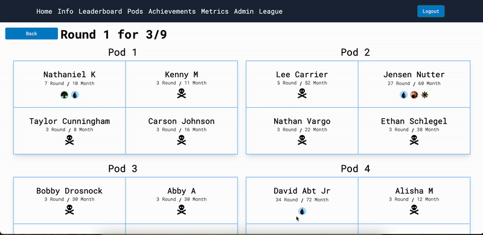
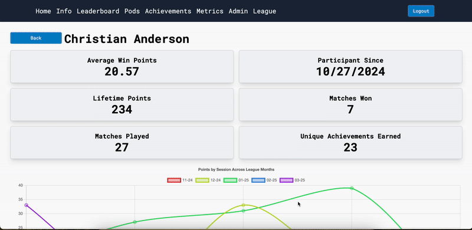
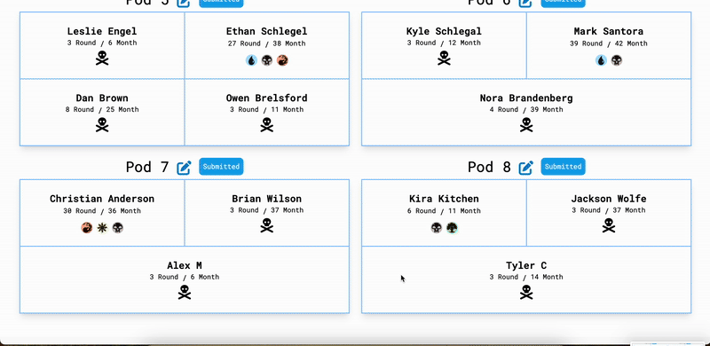

# Commander League Web App

## Background

Commander League is a unique play environment for Magic: The Gathering's 'Commander' format. Each month, participants have the opportunity to build decks and earn points within the league's point structure.

[Click here to view the Commander League Web App](https://mtg-commander-league.xyz/)

This application was developed so that:

1. League volunteers have a singular place to track scores, generate competitive pairings, and generally maintain point structures

2. League participants have a reference place for their performance during league in the form of leaderboards and other metrics

## About This Application

This mono repo contains both the frontend (tabernacle) and backend (tome) for the league app. 

Tabernacle was built using React and Redux Tool Kit. Once my list of desired features is complete I'd like to migrate to Typescript.

Tome is build using Django + Django Rest Framework and connects to a Postgresql DB.

## Example Screenshots

### Pods + Point Modal

### Individual Metrics

### Score Editing

